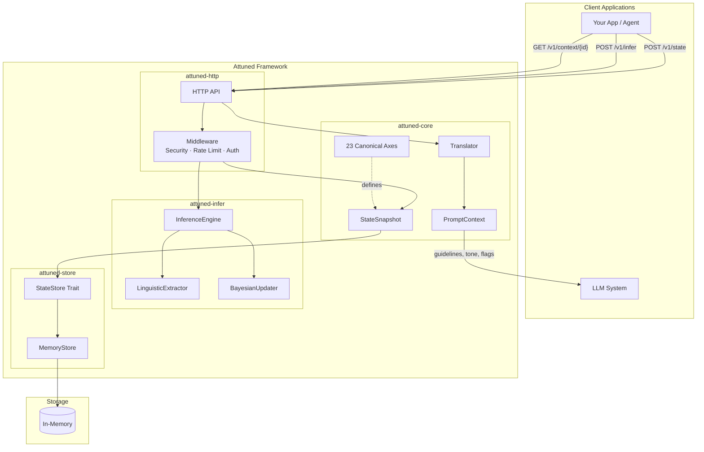
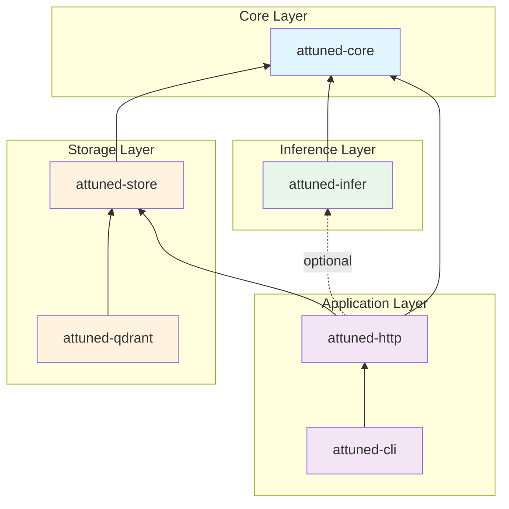
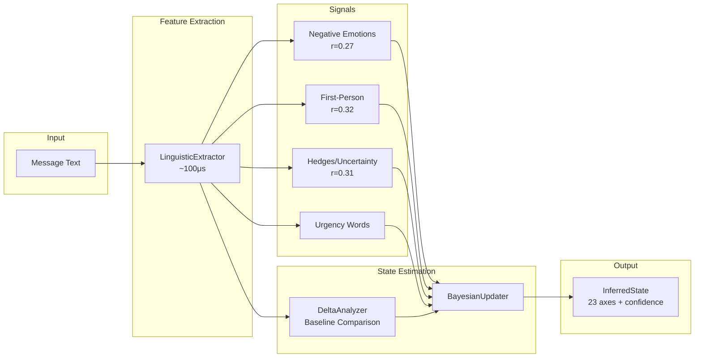
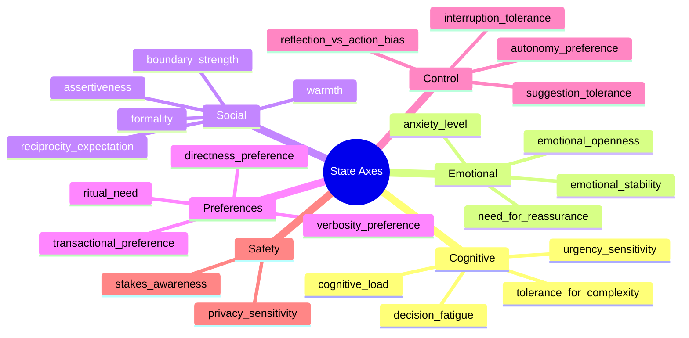

# Attuned

[](LICENSE-APACHE)
[](https://crates.io/crates/attuned-core)
[](https://pypi.org/project/attuned/)
[](https://www.rust-lang.org)
[](#statistical-validation)
[](MANIFESTO.md)

**Declare human state. Get appropriate AI behavior.**

Attuned is the behavioral layer for LLM applications. Set user context, get conditioned responses. Works with any LLM.

## Installation

**Python** (recommended for most users):
```bash
pip install attuned
```
PyPI: https://pypi.org/project/attuned/

**Rust**:
```bash
cargo add attuned-core attuned-store
```
crates.io: https://crates.io/crates/attuned-core

---

## Quick Start (Python)

```python
from attuned import Attuned

# Declare user state - set what you need, rest defaults to neutral
state = Attuned(
    verbosity_preference=0.2,  # Brief responses
    warmth=0.9,                # Warm and friendly
)

# Get prompt context - works with ANY LLM
system_prompt = f"You are an assistant.\n\n{state.prompt()}"

# Use with OpenAI, Anthropic, Ollama, or any LLM
response = openai.chat.completions.create(
    model="gpt-4o-mini",
    messages=[
        {"role": "system", "content": system_prompt},
        {"role": "user", "content": "How do I learn Python?"}
    ]
)
```

### With Presets

```python
from attuned import Attuned

state = Attuned.presets.anxious_user()    # Warm, reassuring, not overwhelming
state = Attuned.presets.busy_executive()  # Brief, formal, direct
state = Attuned.presets.learning_student() # Detailed, patient, educational
```

### With Integrations

```python
from attuned import Attuned
from attuned.integrations.openai import AttunedOpenAI

client = AttunedOpenAI(state=Attuned(verbosity_preference=0.2))
response = client.chat("How do I learn Python?")
```

---

## What is Attuned?

Attuned is a Rust-first framework for representing human state as interpretable vectors (23 axes) and translating that state into machine-consumable interaction constraints.

This is **not** a chatbot, **not** an agent, and **not** an automation engine. It produces *context*, not actions.

## Architecture Overview



## Key Features

- **23-Axis Human State Model**: Interpretable dimensions across cognitive, emotional, social, preference, control, and safety categories
- **Works with ANY LLM**: Output is a string that injects into any system prompt
- **Statistically Validated**: 85% of behavioral effects pass rigorous hypothesis testing
- **Fast NLP Inference** (<500μs): Infer state from natural language without LLMs
- **Research-Validated**: Anxiety detection validated against Dreaddit dataset (F1=0.68)
- **Self-Report Sovereignty**: Explicit values always override inference (max inference confidence: 0.7)

## Statistical Validation

Attuned's behavioral effects are rigorously validated using hypothesis testing with GPT-4o-mini:

| Effect | Result | Effect Size (Cohen's d) |
|--------|--------|-------------------------|
| Verbosity control | 4/4 ✓ | d=7.40 (massive) |
| Warmth/tone | 2/2 ✓ | d=4.11 (massive) |
| Formality | 2/2 ✓ | d=0.83 (large) |
| Cognitive load reduction | 2/2 ✓ | d=1.90 (large) |
| Combined conditions | 2/3 ✓ | d=2.37 (large) |
| **Total** | **11/13 (85%)** | |

**Key findings:**
- `verbosity_preference=0.2` → **70% shorter responses** (p<0.0001)
- `warmth=0.9` → **6x more warm language indicators** (p<0.0001)
- `cognitive_load=0.9` → **82% fewer multi-step plans** (p<0.0001)

Effect size interpretation: d>0.8 is "large", d>2.0 is "very large"

## What Attuned Produces

When you call `state.prompt()`, you get text like this:

```
## Interaction Guidelines
- Offer suggestions, not actions
- Drafts require explicit user approval
- Silence is acceptable if no action is required
- Use warm, friendly language. Include encouraging phrases like 'Great question!'
- Keep responses brief and to the point.

Tone: warm-casual
Verbosity: brief
```

This is injected into the LLM's system prompt. That's it. No magic. Just validated prompt engineering.

## Design Goals

- **Speed & determinism:** Pure Rust, low-latency state reads/writes, predictable behavior
- **Legibility:** Every dimension is human-readable and overrideable
- **Agency by construction:** No side-effects, no hidden optimizers, no "auto-send" patterns
- **Composable:** Embed in any app or agent stack; bring your own transport, storage, and LLM

## Non-Goals (Hard Constraints)

- **No action execution:** Never sends messages, schedules events, moves money, or calls third-party APIs
- **No persuasion optimization:** No engagement maximization, no conversion objectives, no nudges
- **No covert inference drift:** Self-report always overrides inference; inferred signals are bounded and explainable
- **No UI:** Library only (optional reference server feature-gated)
- **No content memory:** Stores state descriptors, not personal content or message history

## Quick Start (Rust)

Add Attuned to your `Cargo.toml`:

```toml
[dependencies]
attuned-core = "1.0"
attuned-store = "1.0"
attuned-infer = "1.0"  # Optional: NLP inference
tokio = { version = "1", features = ["full"] }
```

### Basic Usage

```rust
use attuned_core::{StateSnapshot, Source, RuleTranslator, Translator};
use attuned_store::{MemoryStore, StateStore};

#[tokio::main]
async fn main() -> Result<(), Box<dyn std::error::Error>> {
    // Create a store
    let store = MemoryStore::default();

    // Create a state snapshot
    let snapshot = StateSnapshot::builder()
        .user_id("user_123")
        .source(Source::SelfReport)
        .axis("warmth", 0.7)
        .axis("cognitive_load", 0.9)
        .axis("formality", 0.3)
        .build()?;

    // Store it
    store.upsert_latest(snapshot.clone()).await?;

    // Translate to prompt context
    let translator = RuleTranslator::default();
    let context = translator.to_prompt_context(&snapshot);

    // Use in your LLM system prompt
    println!("Guidelines for LLM:");
    for guideline in &context.guidelines {
        println!("  - {}", guideline);
    }
    println!("Tone: {}", context.tone);
    println!("Verbosity: {:?}", context.verbosity);

    Ok(())
}
```

### With Inference

```rust
use attuned_infer::InferenceEngine;

// Create inference engine
let engine = InferenceEngine::default();

// Infer state from message text
let state = engine.infer("I'm really worried about this deadline!!!");

// All estimates include source and confidence
for estimate in state.all() {
    println!("{}: {:.2} (confidence: {:.2}, source: {})",
        estimate.axis, estimate.value, estimate.confidence, estimate.source.summary());
}
// Output:
// anxiety_level: 0.72 (confidence: 0.58, source: linguistic(anxiety_score))
// urgency_sensitivity: 0.81 (confidence: 0.45, source: linguistic(urgency_score))
```

### With HTTP Server

```rust
use attuned_http::{Server, ServerConfig};
use attuned_store::MemoryStore;

#[tokio::main]
async fn main() -> Result<(), Box<dyn std::error::Error>> {
    let store = MemoryStore::default();

    // Enable inference + security
    let config = ServerConfig::default()
        .with_inference()  // Enables /v1/infer endpoint
        .with_api_keys(["your-secret-key".to_string()])
        .with_rate_limit(1000, 60); // 1000 req/min

    let server = Server::new(store, config);
    server.run().await?;

    Ok(())
}
```

## Crate Architecture



| Crate | Description | Key Types |
|-------|-------------|-----------|
| `attuned-python` | **Python bindings (PyPI: `attuned`)** | `Attuned`, `Presets`, integrations |
| `attuned-core` | Core types, axes, translators, telemetry | `StateSnapshot`, `PromptContext`, `Translator` |
| `attuned-store` | Storage abstraction + in-memory backend | `StateStore`, `MemoryStore` |
| `attuned-qdrant` | Qdrant vector database backend | `QdrantStore`, `QdrantConfig` |
| `attuned-infer` | NLP inference engine | `InferenceEngine`, `LinguisticExtractor`, `Baseline` |
| `attuned-http` | Reference HTTP server with security | `Server`, `ServerConfig`, `AuthConfig` |
| `attuned-cli` | CLI development tool | - |

## API Reference

### Endpoints

| Method | Path | Description | Auth |
|--------|------|-------------|------|
| `POST` | `/v1/state` | Upsert state (with optional inference) | Required |
| `GET` | `/v1/state/{user_id}` | Get latest state | Required |
| `DELETE` | `/v1/state/{user_id}` | Delete state (GDPR) | Required |
| `GET` | `/v1/context/{user_id}` | Get translated PromptContext | Required |
| `POST` | `/v1/translate` | Translate arbitrary state | Required |
| `POST` | `/v1/infer` | Infer axes from text (no storage) | Required |
| `GET` | `/health` | Health check | Public |
| `GET` | `/ready` | Readiness check | Public |

### Example: Infer from Message

```bash
curl -X POST http://localhost:8080/v1/infer \
  -H "Content-Type: application/json" \
  -H "Authorization: Bearer your-api-key" \
  -d '{
    "message": "I urgently need help with this!!!",
    "include_features": true
  }'
```

Response:
```json
{
  "estimates": [
    {
      "axis": "anxiety_level",
      "value": 0.72,
      "confidence": 0.58,
      "source": {"type": "linguistic", "features_used": ["anxiety_score"]}
    },
    {
      "axis": "urgency_sensitivity",
      "value": 0.81,
      "confidence": 0.45,
      "source": {"type": "linguistic", "features_used": ["urgency_score"]}
    }
  ],
  "features": {
    "word_count": 7,
    "urgency_word_count": 1,
    "exclamation_ratio": 0.43
  }
}
```

### Example: Set State with Inference

```bash
curl -X POST http://localhost:8080/v1/state \
  -H "Content-Type: application/json" \
  -H "Authorization: Bearer your-api-key" \
  -d '{
    "user_id": "u_123",
    "message": "I am stressed about the deadline",
    "axes": {
      "warmth": 0.6
    }
  }'
```

Explicit axes (`warmth: 0.6`) override any inferred values. Inference fills in the rest.

### Example: Get Context

```bash
curl http://localhost:8080/v1/context/u_123 \
  -H "Authorization: Bearer your-api-key"
```

Response:
```json
{
  "guidelines": [
    "Offer suggestions, not actions",
    "Acknowledge concerns before providing solutions",
    "Keep responses concise"
  ],
  "tone": "warm and supportive",
  "verbosity": "concise",
  "flags": ["needs_reassurance", "high_cognitive_load"]
}
```

## Inference Pipeline



### Research Validation

Validated against [Dreaddit dataset](https://aclanthology.org/D19-6213/) (3,553 labeled Reddit posts):

| Model | F1 Score | Improvement |
|-------|----------|-------------|
| v1 (hedges only) | 0.582 | baseline |
| v2 (+ negative emotions) | 0.679 | +16.7% |

Key correlations with stress label:
- Negative emotion words: r=0.27
- First-person pronouns: r=0.32
- Uncertainty markers: r=0.31

## Canonical Axes (23)

State is represented across 23 interpretable axes, all normalized to `[0.0, 1.0]`:



### Axis Categories

| Category | Axes | Affects |
|----------|------|---------|
| **Cognitive** | `cognitive_load`, `decision_fatigue`, `tolerance_for_complexity`, `urgency_sensitivity` | Response complexity, pacing |
| **Emotional** | `emotional_openness`, `emotional_stability`, `anxiety_level`, `need_for_reassurance` | Empathy, reassurance level |
| **Social** | `warmth`, `formality`, `boundary_strength`, `assertiveness`, `reciprocity_expectation` | Tone, interaction style |
| **Preferences** | `ritual_need`, `transactional_preference`, `verbosity_preference`, `directness_preference` | Response format, length |
| **Control** | `autonomy_preference`, `suggestion_tolerance`, `interruption_tolerance`, `reflection_vs_action_bias` | Agency, guidance level |
| **Safety** | `stakes_awareness`, `privacy_sensitivity` | Caution level, sensitivity |

## Security

Attuned includes comprehensive security features. See [SECURITY.md](SECURITY.md) for full details.

| Feature | Default | Configuration |
|---------|---------|---------------|
| Bind address | `127.0.0.1:8080` | Localhost only |
| Body limit | 1 MB | `ServerConfig.body_limit` |
| Rate limiting | 100 req/min | `ServerConfig.with_rate_limit()` |
| API authentication | Disabled | `ServerConfig.with_api_keys()` |
| Security headers | Enabled | `ServerConfig.security_headers` |
| PII in logs | Redacted | Automatic |
| Message storage | **Never** | By design |

## Performance

| Operation | Latency | Notes |
|-----------|---------|-------|
| Linguistic extraction | ~100μs | Pure Rust, no regex |
| Full inference | <500μs | Including baseline comparison |
| Axis lookup | 6 ns | 169M ops/sec |
| Translation | 214 ns | Full 23 axes |
| State storage | ~10μs | In-memory |

Run benchmarks:
```bash
cargo bench -p attuned-core
```

## Development

```bash
# Build all crates
cargo build --workspace

# Build with inference
cargo build --workspace --features inference

# Run tests
cargo test --workspace

# Run security audit
cargo audit

# Run benchmarks
cargo bench -p attuned-core

# Format code
cargo fmt --all

# Lint
cargo clippy --workspace
```

## Documentation

| Document | Description |
|----------|-------------|
| [Python README](crates/attuned-python/README.md) | Python quick start and integrations |
| [TECHNICAL.md](TECHNICAL.md) | Quick-reference specification (data contracts, constraints, APIs) |
| [MANIFESTO.md](MANIFESTO.md) | Philosophical principles and hard constraints |
| [SECURITY.md](SECURITY.md) | Security policies and responsible disclosure |

Detailed technical documentation is available in [`tasks/reports/`](tasks/reports/):

- [System Architecture](tasks/reports/01-system-architecture.md)
- [23-Axis Model](tasks/reports/02-axis-model.md)
- [Inference Engine](tasks/reports/03-inference-engine.md)
- [HTTP API Reference](tasks/reports/04-http-api-reference.md)
- [Integration Guide](tasks/reports/05-integration-guide.md)

## License

Licensed under the Apache License, Version 2.0. See [LICENSE-APACHE](LICENSE-APACHE) for details.

## Contributing

Contributions are welcome! Before contributing, please read:

- [MANIFESTO.md](MANIFESTO.md) - Our philosophical principles and hard constraints
- [SECURITY.md](SECURITY.md) - Security policies and responsible disclosure

Contributors who submit code implicitly agree to uphold the principles in the manifesto. We do not ship features that treat users as targets rather than principals.
