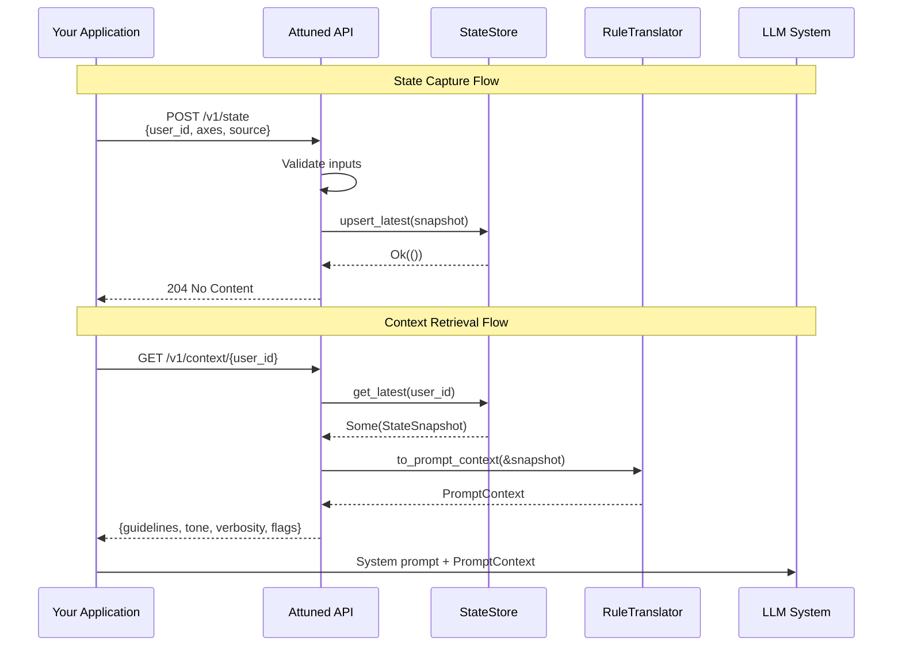

# Attuned

[](LICENSE-MIT)
[](https://www.rust-lang.org)
[](SECURITY.md)
[](MANIFESTO.md)

**Attuned** is a minimal, Rust-first framework for representing human state as interpretable vectors and translating that state into machine-consumable interaction constraints for LLM/agent systems.

This is **not** a chatbot, **not** an agent, and **not** an automation engine. It produces *context*, not actions.

## Architecture Overview


## Data Flow



## Design Goals

- **Speed & determinism:** Pure Rust, low-latency state reads/writes, predictable behavior
- **Legibility:** Every dimension is human-readable and overrideable
- **Agency by construction:** No side-effects, no hidden optimizers, no "auto-send" patterns
- **Composable:** Embed in any app or agent stack; bring your own transport, storage, and LLM

## Non-Goals (Hard Constraints)

- **No action execution:** Never sends messages, schedules events, moves money, or calls third-party APIs
- **No persuasion optimization:** No engagement maximization, no conversion objectives, no nudges
- **No covert inference drift:** Self-report always overrides inference; inferred signals are bounded and explainable
- **No UI:** Library only (optional reference server feature-gated)
- **No content memory:** Stores state descriptors, not personal content or message history

## Quick Start

Add Attuned to your `Cargo.toml`:

```toml
[dependencies]
attuned-core = "0.1"
attuned-store = "0.1"
tokio = { version = "1", features = ["full"] }
```

### Basic Usage

```rust
use attuned_core::{StateSnapshot, Source, RuleTranslator, Translator};
use attuned_store::{MemoryStore, StateStore};

#[tokio::main]
async fn main() -> Result<(), Box<dyn std::error::Error>> {
    // Create a store
    let store = MemoryStore::default();

    // Create a state snapshot
    let snapshot = StateSnapshot::builder()
        .user_id("user_123")
        .source(Source::SelfReport)
        .axis("warmth", 0.7)
        .axis("cognitive_load", 0.9)
        .axis("formality", 0.3)
        .build()?;

    // Store it
    store.upsert_latest(snapshot.clone()).await?;

    // Translate to prompt context
    let translator = RuleTranslator::default();
    let context = translator.to_prompt_context(&snapshot);

    // Use in your LLM system prompt
    println!("Guidelines for LLM:");
    for guideline in &context.guidelines {
        println!("  - {}", guideline);
    }
    println!("Tone: {}", context.tone);
    println!("Verbosity: {:?}", context.verbosity);

    Ok(())
}
```

### With HTTP Server

```rust
use attuned_http::{Server, ServerConfig};
use attuned_store::MemoryStore;

#[tokio::main]
async fn main() -> Result<(), Box<dyn std::error::Error>> {
    let store = MemoryStore::default();

    // Production configuration with security enabled
    let config = ServerConfig::default()
        .with_api_keys(["your-secret-key".to_string()])
        .with_rate_limit(1000, 60); // 1000 req/min

    let server = Server::new(store, config);
    server.run().await?;

    Ok(())
}
```

## Crate Architecture


| Crate | Description | Key Types |
|-------|-------------|-----------|
| `attuned-core` | Core types, axes, translators, telemetry | `StateSnapshot`, `PromptContext`, `Translator` |
| `attuned-store` | Storage abstraction + in-memory backend | `StateStore`, `MemoryStore` |
| `attuned-qdrant` | Qdrant vector database backend | `QdrantStore`, `QdrantConfig` |
| `attuned-http` | Reference HTTP server with security | `Server`, `ServerConfig`, `AuthConfig` |
| `attuned-cli` | CLI development tool | - |

## API Reference

### Endpoints

| Method | Path | Description | Auth |
|--------|------|-------------|------|
| `POST` | `/v1/state` | Upsert state (patch semantics) | Required |
| `GET` | `/v1/state/{user_id}` | Get latest state | Required |
| `DELETE` | `/v1/state/{user_id}` | Delete state (GDPR) | Required |
| `GET` | `/v1/context/{user_id}` | Get translated PromptContext | Required |
| `POST` | `/v1/translate` | Translate arbitrary state | Required |
| `GET` | `/health` | Health check | Public |
| `GET` | `/ready` | Readiness check | Public |

### Request/Response Flow


### Example: Set State

```bash
curl -X POST http://localhost:8080/v1/state \
  -H "Content-Type: application/json" \
  -H "Authorization: Bearer your-api-key" \
  -d '{
    "user_id": "u_123",
    "source": "self_report",
    "confidence": 1.0,
    "axes": {
      "warmth": 0.6,
      "formality": 0.3,
      "cognitive_load": 0.8
    }
  }'
```

### Example: Get Context

```bash
curl http://localhost:8080/v1/context/u_123 \
  -H "Authorization: Bearer your-api-key"
```

Response:
```json
{
  "guidelines": [
    "Offer suggestions, not actions",
    "Drafts require explicit user approval",
    "Silence is acceptable if no action is required",
    "Keep responses concise; avoid multi-step plans unless requested"
  ],
  "tone": "warm-casual",
  "verbosity": "medium",
  "flags": ["high_cognitive_load"]
}
```

## Translation Pipeline

The `RuleTranslator` converts axis values into actionable LLM context:

```mermaid
flowchart LR
    subgraph Input
        SS[StateSnapshot<br/>23 axis values]
    end

    subgraph "Translation Rules"
        direction TB
        R1[Warmth → Tone]
        R2[Formality → Tone modifier]
        R3[Verbosity Pref → Verbosity level]
        R4[Cognitive Load → Flags]
        R5[Suggestion Tolerance → Guidelines]
    end

    subgraph Output
        PC[PromptContext]
        G[guidelines: Vec<String>]
        T[tone: String]
        V[verbosity: Low|Medium|High]
        F[flags: Vec<String>]
    end

    SS --> R1 & R2 & R3 & R4 & R5
    R1 & R2 --> T
    R3 --> V
    R4 --> F
    R5 --> G
    T & V & F & G --> PC
```

### Threshold Configuration

```rust
let thresholds = Thresholds {
    high: 0.7,  // Axis value >= 0.7 triggers "high" behavior
    low: 0.3,   // Axis value <= 0.3 triggers "low" behavior
};

let translator = RuleTranslator::new(thresholds);
```

## Canonical Axes (23)

State is represented across 23 interpretable axes, all normalized to `[0.0, 1.0]`:


### Axis Categories

| Category | Axes | Affects |
|----------|------|---------|
| **Cognitive** | `cognitive_load`, `decision_fatigue`, `tolerance_for_complexity`, `urgency_sensitivity` | Response complexity, pacing |
| **Emotional** | `emotional_openness`, `emotional_stability`, `anxiety_level`, `need_for_reassurance` | Empathy, reassurance level |
| **Social** | `warmth`, `formality`, `boundary_strength`, `assertiveness`, `reciprocity_expectation` | Tone, interaction style |
| **Preferences** | `ritual_need`, `transactional_preference`, `verbosity_preference`, `directness_preference` | Response format, length |
| **Control** | `autonomy_preference`, `suggestion_tolerance`, `interruption_tolerance`, `reflection_vs_action_bias` | Agency, suggestion frequency |
| **Safety** | `stakes_awareness`, `privacy_sensitivity` | Caution level, data handling |

## Security

Attuned includes comprehensive security features. See [SECURITY.md](SECURITY.md) for full details.

### Security Architecture


### Key Security Features

| Feature | Default | Configuration |
|---------|---------|---------------|
| Bind address | `127.0.0.1:8080` | Localhost only |
| Body limit | 1 MB | `ServerConfig.body_limit` |
| Rate limiting | 100 req/min | `ServerConfig.with_rate_limit()` |
| API authentication | Disabled | `ServerConfig.with_api_keys()` |
| Security headers | Enabled | `ServerConfig.security_headers` |
| PII in logs | Redacted | Automatic |

## Performance

Benchmarked on Linux x86_64 (Rust 1.92.0, release mode):

| Operation | Latency | Throughput |
|-----------|---------|------------|
| Axis lookup | 6 ns | 169M ops/sec |
| Translation (minimal) | 34 ns | 29M ops/sec |
| Translation (full 23 axes) | 214 ns | 4.7M ops/sec |
| Snapshot creation (23 axes) | 1.2 µs | 813K ops/sec |
| JSON roundtrip | 488 ns | 2M ops/sec |

**Key characteristics:**
- Sub-microsecond core operations
- Linear scaling with axis count (~50ns per axis)
- Real-time safe (all ops < 2µs)
- Zero allocations in hot paths

Run benchmarks:
```bash
cargo bench -p attuned-core
```

## Storage Backends


### MemoryStore (Default)

Thread-safe, zero-copy in-memory storage using `DashMap`:

```rust
let store = MemoryStore::default();
```

### QdrantStore (Persistent)

Vector database backend for production deployments:

```rust
let config = QdrantConfig {
    url: "http://localhost:6334".to_string(),
    collection: "attuned_states".to_string(),
    ..Default::default()
};
let store = QdrantStore::new(config).await?;
```

## Observability


### Telemetry Setup

```rust
use attuned_core::{init_tracing, TracingConfig, TracingFormat};

// JSON logging for production
init_tracing(TracingConfig {
    format: TracingFormat::Json,
    level: "info".to_string(),
    ..Default::default()
});
```

### Health Endpoints

- `GET /health` - Aggregated health status with component checks
- `GET /ready` - Kubernetes-style readiness probe

## Development

```bash
# Build all crates
cargo build --workspace

# Run tests
cargo test --workspace

# Run security audit
cargo audit

# Run benchmarks
cargo bench -p attuned-core

# Format code
cargo fmt --all

# Lint
cargo clippy --workspace
```

## License

Licensed under either of:

- Apache License, Version 2.0 ([LICENSE-APACHE](LICENSE-APACHE))
- MIT license ([LICENSE-MIT](LICENSE-MIT))

at your option.

## Contributing

Contributions are welcome! Before contributing, please read:

- [MANIFESTO.md](MANIFESTO.md) - Our philosophical principles and hard constraints
- [SECURITY.md](SECURITY.md) - Security policies and responsible disclosure

Contributors who submit code implicitly agree to uphold the principles in the manifesto. We do not ship features that treat users as targets rather than principals.
# Attuned
